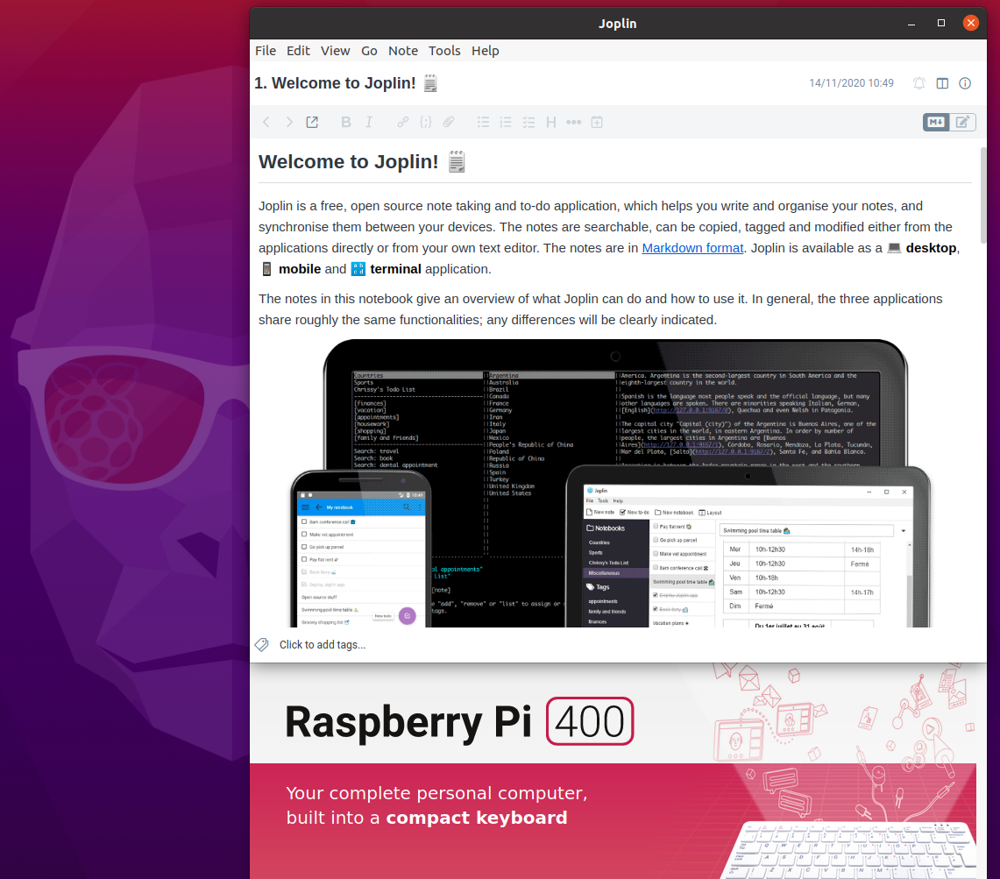

## Helper script to build joplin for arm64 systems

The `build.sh` script contains the modified steps required to download and build
the latest version of the [joplin](https://github.com/laurent22/joplin)
software on ARM64 architectures, such as the Raspberry Pi.

The main difference with the official build procedure is the removal of the
keytar module dependency. This module is not available for the target
architecture, see [related discussion](https://github.com/laurent22/joplin/issues/3711).

This has been tested on Ubuntu 20.10 running on a Raspberry Pi 400.

## Dependencies

**There is no explicit management of dependencies**, you will need to install
all the tools required to build joplin, such as gcc, node, npm, python, etc.

Joplin requires [sharp](https://sharp.pixelplumbing.com/), depending on your distro it may be necessary for you to manually compile it or its own dependency **libvips**, if your package manager does not provide the newest version.

The script needs **jq** a sed-style json editor.

## Miscellaneous

The compilation might take a while especially on lower powered ARM systems.
Additionally it may be necessary to increase the npm timeout as per [this thread](https://stackoverflow.com/questions/51434006/how-to-fix-timeout-for-packages-on-npm-install), as the npm build can easily slow down the system enough that the default npm timeout of 1 minute is reached, after which the build fails.

The script will place all temporary results in a subdirectory of `/tmp` and, upon
success, package the Cli and Electron clients in a `dist` directory next to the
source script.

The code is provided as-is, free to use and modify.
